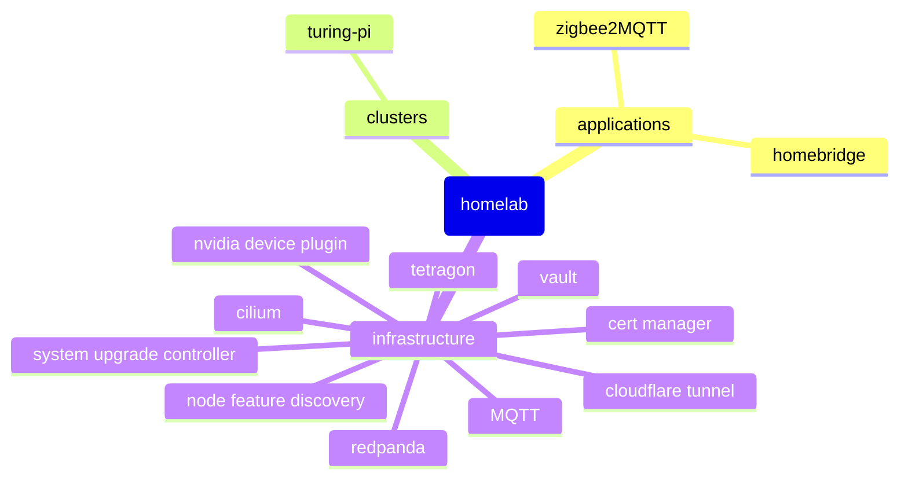

# Homelab

Continuously deployed bare metal kubernetes cluster living on the edge.


## Getting Started

### Turing Pi

A compact AI & edge computing cluster.



#### Build

- [Densium APU](https://densium.net/products/densium-apu?Frontpanel=Dark+Walnut&Exterior=Black) 4L
- [Noctua NF-A14 ULN](https://noctua.at/en/products/fan/nf-a14-uln) 140mm
- [Pico PSU](https://turingpi.com/product/pico-psu/) 160w
- 3x [Turing RK1](https://turingpi.com/product/turing-rk1) 8 cores /  32 GB / 6 TOPS
- 1x [Nvidia Jetson Orin NX](https://www.nvidia.com/en-us/autonomous-machines/embedded-systems/jetson-orin/#tech-specs) 8 cores /  16 GB / 100 TOPS
- 4x [Samsung 970 EVO Plus NVMe M.2 SSD](https://www.samsung.com/us/computing/memory-storage/solid-state-drives/ssd-970-evo-plus-nvme-m-2-250gb-mz-v7s250b-am/) 250GB

32 cores / 112 GB / 118 TOPS

1TB storage

<https://turingpi.com/>

#### Flashing Nodes

##### Turing RK1

```sh
ssh turingpi
cd /mnt/sdcard

curl -k https://firmware.turingpi.com/turing-rk1/ubuntu_22.04_rockchip_linux/v1.32/ubuntu-22.04.3-preinstalled-desktop-arm64-turing-rk1_v1.32.img.xz -o ubuntu-22.04.3-preinstalled-desktop-arm64-turing-rk1_v1.32.img.xz
xz -d  ubuntu-22.04.3-preinstalled-desktop-arm64-turing-rk1_v1.32.img.xz

tpi flash -n NODE -i /mnt/sdcard/ubuntu-22.04.3-preinstalled-server-arm64-turing-rk1_v1.32.img
```

##### Nvidia Jetson Orin NX

<https://gist.github.com/dudo/4093b5d14f2b003cad507e4f4ac1aa83>

### Kubernetes (via k3s)

An open-source system for automating deployment, scaling, and management of containerized applications.

<https://docs.k3s.io/>
<https://kubernetes.io/docs/reference/kubectl/cheatsheet/>

### ArgoCD

Used to **pull** repository changes into a kubernetes clusters.

<https://argo-cd.readthedocs.io/en/stable/>

### Cilium

Used for providing, securing, and observing network connectivity between workloads, powered by eBPF.

<https://cilium.io/>

### Brew

The Missing Package Manager for macOS (or Linux).

<https://brew.sh>

This repo includes a collection of dependencies to install:

```sh
brew bundle
```

## Usage

### Bootstrap

When spinning up the cluster for the first time, there are 3 primary steps.

1. Install `k3s`

    <https://docs.turingpi.com/docs/turing-pi2-kubernetes-installation>
    <https://docs.k3s.io/installation/configuration>
    <https://docs.k3s.io/installation/network-options>

    ```sh
    # Controller

    export K3S_TOKEN=$(uuidgen)
    export CONTROLLER_IP=192.168.4.78

    curl -sfL https://get.k3s.io | sh -s - \
    --write-kubeconfig-mode 644 \
    --token $K3S_TOKEN \
    --node-ip $CONTROLLER_IP \
    --flannel-backend=none \
    --disable-cloud-controller \
    --disable-kube-proxy \
    --disable-network-policy \
    --disable local-storage \
    --disable servicelb \
    --disable traefik

    # Workers

    export K3S_TOKEN=
    export K3S_URL=https://$CONTROLLER_IP:6443

    curl -sfL https://get.k3s.io | sh -

    # optional check to ensure a node is fully operational
    k3s check-config

    # Label

    kubectl label nodes rk11 rk12 rk13 jetson1 kubernetes.io/role=worker
    kubectl label nodes jetson1 nvidia.com/gpu.present=true
    ```

2. Bootstrap `cilium`

    <https://docs.cilium.io/en/stable/gettingstarted/k8s-install-default/>

    - [System Requirements](https://docs.cilium.io/en/stable/operations/system_requirements/#admin-system-reqs)
    - [Rebuilding the Linux Kernel](https://gist.github.com/dudo/7d853fd54f2d3db6e5e44b8b59ae12d5)

    ```sh
    cilium install --version 1.15.4
    cilium status --wait
    ```

3. Bootstrap `argocd`

    <https://argo-cd.readthedocs.io/en/stable/getting_started/#1-install-argo-cd>

    ```sh
    kubectl create namespace argocd
    kubectl apply -n argocd -f https://raw.githubusercontent.com/argoproj/argo-cd/stable/manifests/install.yaml

    kubectl apply -f ./config/application.yaml
    kubectl apply -f ./root.yaml

    # TODO: Add Gateway API setup
    kubectl port-forward svc/argocd-server -n argocd 8080:443
    ```

    <https://localhost:8080>
